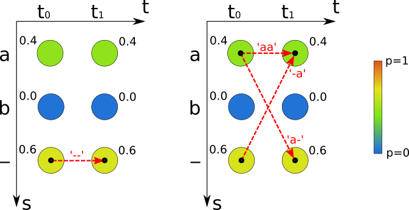
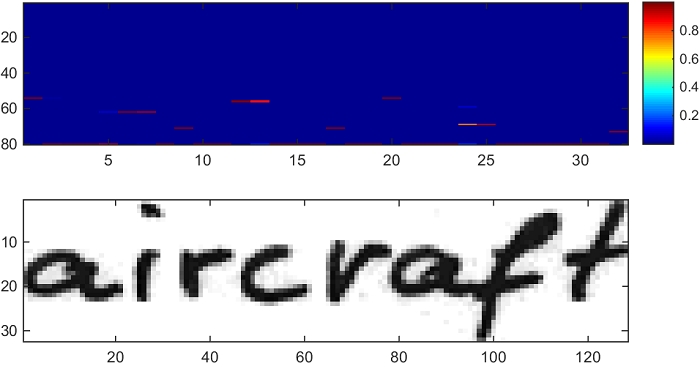
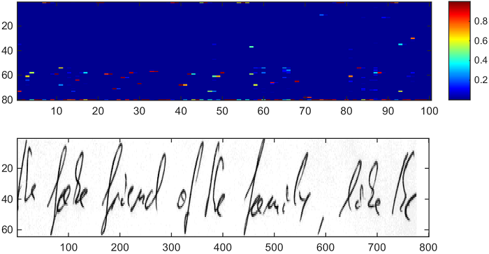

# Testcases

## Mini example
The RNN output matrix of the **Mini example** testcase contains 2 time-steps (t0 and t1) and 3 labels (a, b and - representing the CTC-blank).
Best path decoding (see left figure) takes the most probable label per time-step which gives the path "--" and therefore the recognized text "" with probability 0.6 * 0.6 = 0.36.
Beam search, prefix search and token passing calculate the probability of labelings. 
For the labeling "a" these algorithms sum over the paths "-a", "a-" and "aa" (see right figure) with probability 0.6 * 0.4 + 0.4 * 0.6 + 0.4 *0.4 = 0.64.
The only path which gives "" still has probability 0.36, therefore "a" is the result returned by beam search, prefix search and token passing.

## Word example
The **Word example** testcase contains a single word from the IAM Handwriting Database. 
It is used to test lexicon search.
RNN output was generated with the [SimpleHTR](https://github.com/githubharald/SimpleHTR) model (by using the `--dump` option).
Lexicon search first computes an approximation with best path decoding, then searches for similar words in a dictionary using a BK tree, and finally scores them by computing the loss and returning the most probable dictionary word.
Best path decoding outputs "aircrapt", lexicon search is able to find similar words like "aircraft" and "airplane" in the dictionary, calculates a score for each of them and finally returns "aircraft", which is the correct result.
The figure below shows the input image and the RNN output matrix with 32 time-steps and 80 classes (the last one being the CTC-blank).
Each column sums to 1 and each entry represents the probability of seeing a label at a given time-step.

## Line example
The ground-truth text of the **Line example** testcase is "the fake friend of the family, like the" and is a sample from the IAM Handwriting Database. 
This test case is used to test all algorithms except lexicon search.
RNN output was generated by a partially trained TensorFlow model inspired by CRNN which essentially is a larger version of the [SimpleHTR](https://github.com/githubharald/SimpleHTR) model.
The figure below shows the input image and the RNN output matrix with 100 time-steps and 80 classes. 

